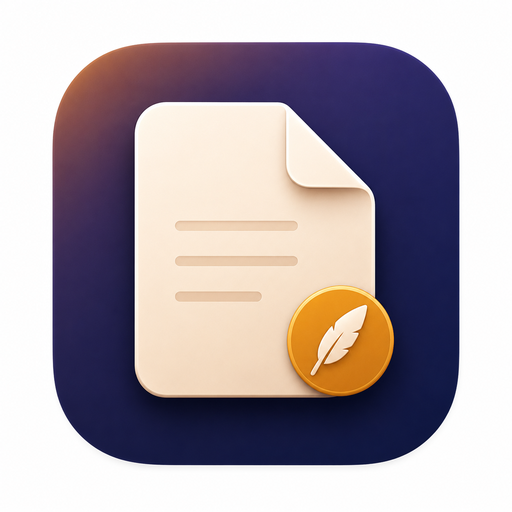
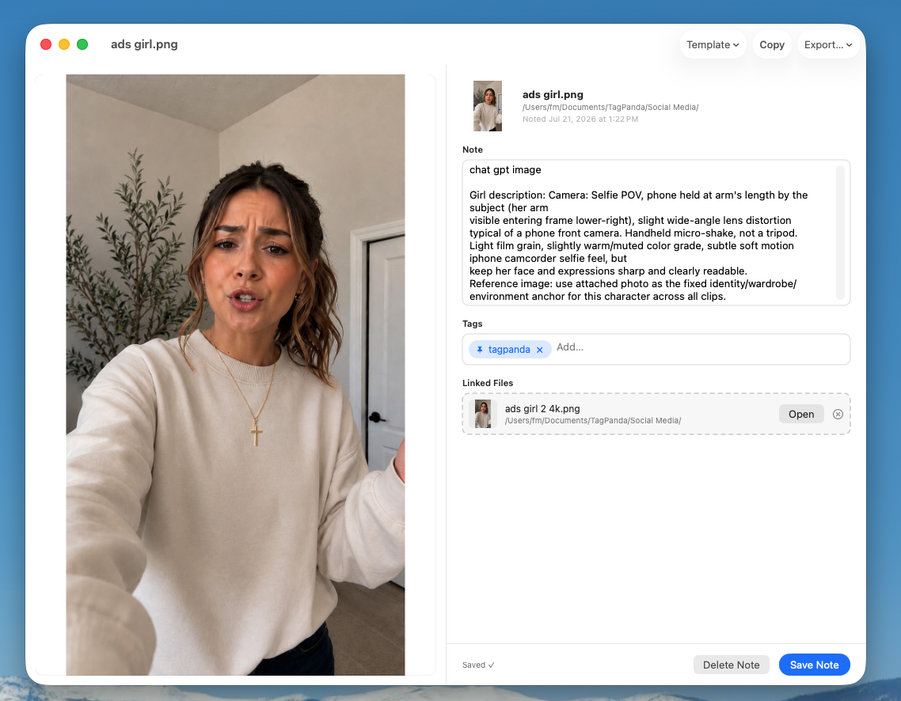

# FileLore

<p align="center">
  
</p>

<p align="center">
  <strong>Notes that stay with your files — through renames, moves, and everything else.</strong>
</p>

<p align="center">
  <a href="LICENSE"></a>
  
  
</p>

FileLore attaches a sticky note to any file on your Mac or Windows PC. The note
lives **on the file itself** — not in a database, not in the cloud — so it
travels with the file through renames and folder moves on the same volume.
Notes are plain JSON, fully compatible between the two platforms.

Built with AI creators in mind: keep generation prompts, model info, and
reference links attached to the media they produced.

<p align="center">
  
</p>

## Download

Get the latest release from **https://filelore.netlify.app** or the
[**GitHub Releases**](https://github.com/Francom121/FileLore/releases) page:

- **macOS** — `FileLore-macOS.zip` (unzip, drag to Applications). Once
  installed, the app **auto-updates itself via Sparkle** — no more manual
  downloads.
- **Windows** — `FileLore-Windows-Setup-x64.exe` (or `-arm64` on ARM PCs;
  run it — per-user install, no admin needed). Once installed, the app
  **auto-updates itself via Velopack**.

Free, no accounts, no telemetry.

## Features

**macOS** (current: 1.1.0)

- Notes stored in the file's `com.filelore.note` extended attribute (xattr)
- Quill **badge in Finder** on noted files (Finder Sync extension)
- **Quick Look peek** — spacebar shows the note alongside a preview for file
  types no system previewer claims (PSD, MKV, Markdown…)
- Global hotkeys: **⌥T** opens the note for the Finder selection, **⇧⌘F**
  opens search (both customizable)
- **Batch notes**: tag and annotate many files in one action
- Spotlight-style **search** across every noted file (name > tags > body,
  tag-chip filters)
- **Tags + pinned tags**, note templates, linked reference files
- Menu bar quick access (recents, pinned tags, shortcuts panel)
- One-click **Markdown export** (per note or batch)
- **Sparkle auto-update** with signed releases

**Windows** (current: 0.7.1)

- Notes stored in the file's `filelore.note` **NTFS alternate data stream (ADS)**
- System tray app with recents, pinned tags, and quick actions
- Global hotkeys: **Ctrl+Alt+T** note the Explorer selection, **Ctrl+Alt+F**
  search (both rebindable)
- **Batch** tagging/notes over a multi-select in one window
- Search with tag chips and pinned tags, Markdown export
- Templates, linked reference files, media peek (video/audio/images) in the
  editor
- Native **first-run launcher** — instant branded feedback while the app gets
  ready
- Optional **Explorer badge** on noted files (opt-in; Windows registers icon
  overlays machine-wide, so this one feature asks for admin **once**)
- Per-user install, no admin, no background services

## How it works

The note is stored **in the file's own filesystem metadata**, right next to its
bytes:

| Platform | Mechanism | Name |
|---|---|---|
| macOS | extended attribute | `com.filelore.note` |
| Windows | NTFS alternate data stream | `<path>:filelore.note` |

Because the note lives on the file, it survives **renames and moves on the same
volume** with zero bookkeeping. There is no database to back up, no account, no
cloud sync — the file *is* the database.

Honest limitations: copying a file to **another volume**, zipping it, or
sending it through most cloud-sync tools usually strips the note (the
destination filesystem never sees the metadata). On Windows, notes only work on
**NTFS** locations — network shares, mapped drives, and FAT32/exFAT sticks
can't hold ADS streams, and the app says so instead of failing.

## The note format (cross-platform)

Notes are a small JSON envelope, **byte-compatible between macOS and
Windows** — a note written on one platform reads fine on the other:

```json
{
  "note" : {
    "body" : "Prompt: a fox made of stained glass, studio lighting\nModel: flux-1-dev",
    "created" : 782451200.0,
    "links" : [
      {
        "bookmark" : "Ym9vay…",
        "displayName" : "reference-fox.jpg",
        "id" : "3F2504E0-4F89-41D3-9A0C-0305E82C3301",
        "relativePathHint" : "reference-fox.jpg"
      }
    ],
    "modified" : 782452800.0,
    "tags" : ["ai-gen", "fox"]
  },
  "version" : 1
}
```

- `created` / `modified` are doubles: **seconds since 2001-01-01T00:00:00Z**
  (the Apple reference date — this is Swift `JSONEncoder`'s default date
  encoding, mirrored exactly on Windows).
- `bookmark` is a base64 security-scoped bookmark on macOS (resolves by file
  identity); on Windows it's an opaque placeholder and links resolve by path.
- Windows **adds** `path`, `size`, and `added` keys to link entries. Swift
  `Codable` ignores unknown keys, so both directions stay readable.
- **Compatibility rule: additive keys only.** Never rename, remove, or retype
  an existing key. `version` exists for deliberate future migrations.

## Build from source

### macOS

Requirements: **Xcode** (built with Xcode 26) on macOS 15+. The project is
folder-synced — no generators, just open `FileLore.xcodeproj`.

```sh
# Core package tests (84 tests)
cd TetherCore && swift test

# App + both extensions
xcodebuild -project FileLore.xcodeproj -scheme FileLore -configuration Release \
  -destination 'platform=macOS' build
```

Then copy `FileLore.app` from the build products directory to `/Applications`.
The app is **ad-hoc signed** (no Apple Developer account needed), so:

1. First launch: right-click → **Open** (one-time Gatekeeper bypass).
2. Enable the two extensions once: **System Settings → Privacy & Security →
   Extensions** → FileLore (Finder Extensions + Quick Look).

### Windows

Requirements: **.NET 8 SDK** on Windows. Publishes a self-contained
single-file exe (no .NET install needed on target machines):

```bat
dotnet publish src\FileLore.App\FileLore.App.csproj -c Release -r win-x64 ^
  --self-contained true -p:PublishSingleFile=true ^
  -p:IncludeNativeLibrariesForSelfExtract=true
```

(from the `windows/` directory; swap `-r win-x64` for `-r win-arm64` on ARM64
devices.) Then run `tools\Install-FileLore.cmd` for the per-user installer, or
just run `FileLoreApp.exe` standalone.

Optional native pieces (require **MSVC / Visual Studio Build Tools**): the
first-run launcher (`src\FileLore.Launcher\build-launcher.cmd`) and the
Explorer overlay badge (`src\FileLore.Overlay\build-overlay.cmd`), both for
x64 + ARM64.

## Project layout

```
├── FileLore.xcodeproj/       hand-authored, folder-synced Xcode project
├── FileLore/                 SwiftUI macOS app (editor, search, menu bar, hotkeys, batch)
├── FileLoreFinderSync/       Finder Sync extension — badges + context menu
├── FileLoreQuickLook/        Quick Look extension — media + note split preview
├── TetherCore/               shared Swift package (note model, store, search, export)
│   └── Tests/                84 XCTest tests — swift test
├── windows/
│   ├── src/FileLore.Core/    .NET 8 library — ADS note store, index, search, export
│   ├── src/FileLore.App/     WPF app (editor, tray, hotkeys, batch, search)
│   ├── src/FileLore.Launcher/ native Win32 first-run launcher
│   ├── src/FileLore.Overlay/  native Explorer icon-overlay badge (opt-in)
│   └── tools/                installer, uninstaller, diagnostics scripts
├── website/                  marketing site (React + Vite) — filelore.netlify.app
└── docs/assets/              README images
```

(`TetherCore` keeps its legacy module name from the app's original codename —
the user-facing name is FileLore everywhere.)

## Testing

- **macOS:** `cd TetherCore && swift test` — 84 tests covering the note codec,
  xattr store, bookmarks, search, batch, export, and media preview.
- **Windows:** headless selftests against the built app, e.g.
  `FileLoreApp.exe --selftest search results.txt`
  (suites: save round-trip, `search`, `netpath`, `links`, `batch`, `export`,
  `templates`, `pins`, `hotkeys`). See `windows/README.md`.

## Roadmap

- Windows **auto-update** (Velopack), matching the Mac's Sparkle experience
- **Code signing** on both platforms (SmartScreen / Gatekeeper friction)
- Modern Windows 11 context menu via **MSIX** packaging

## Contributing

Contributions welcome! See [CONTRIBUTING.md](CONTRIBUTING.md) — the one hard
rule: the note JSON format is cross-platform-sacred, additive changes only.

## License

[MIT](LICENSE) — free for personal and commercial use.
